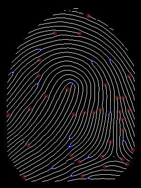

# 🔍 Biometric Match

This project is an implementation of a fingerprint matching system using Python. It includes preprocessing, enhancement, feature extraction, and a simple fingerprint comparison model. Ideal for biometric authentication systems, academic projects, or proof-of-concept demos.

---

## 📁 Project Structure

```
Fingerprint-Matching-Model/
│
├── EnhancementScript/              # Fingerprint enhancement scripts
├── enhanced/                       # Enhanced fingerprint images (output)
├── fingerprint_feature_extractor/ # Feature extraction logic
├── model/                          # Matching logic / trained models
│
├── example.py                      # Sample usage script
├── result.png                      # Example result image of fingerprint match
├── LICENSE                         # MIT License
├── .gitignore                      # Git ignored files
```

---

## 🚀 Features

- ✅ Fingerprint image preprocessing and enhancement
- ✅ Feature extraction using biometric techniques
- ✅ Matching fingerprints using a trained model or algorithm
- ✅ Visual comparison output for result interpretation

---

## 🧪 How to Run

### 1. Clone the Repository
```bash
git clone https://github.com/your-username/Fingerprint-Matching-Model.git
cd Fingerprint-Matching-Model
```

### 2. Install Dependencies

Create a virtual environment (optional but recommended):

```bash
python -m venv venv
source venv/bin/activate  # On Windows use: venv\Scripts\activate
```

Install packages (create a `requirements.txt` file if needed):

```bash
pip install opencv-python numpy scikit-learn matplotlib
```

### 3. Run the Example Script

```bash
python example.py
```

This script will run the pipeline and save a visual output as `result.png`.

---

## 📷 Example Output



---

## 🛠 Tech Stack

- **Language**: Python
- **Libraries**: OpenCV, NumPy, scikit-learn, matplotlib
- **Application**: Image Processing, Biometrics

---

## 🧠 Future Enhancements

- Real-time fingerprint scanner integration
- Deep learning-based matcher
- Performance benchmarking
- Web or mobile interface

---

## 🤝 Contributing

Pull requests are welcome! For major changes, please open an issue first to discuss what you'd like to change or improve.
